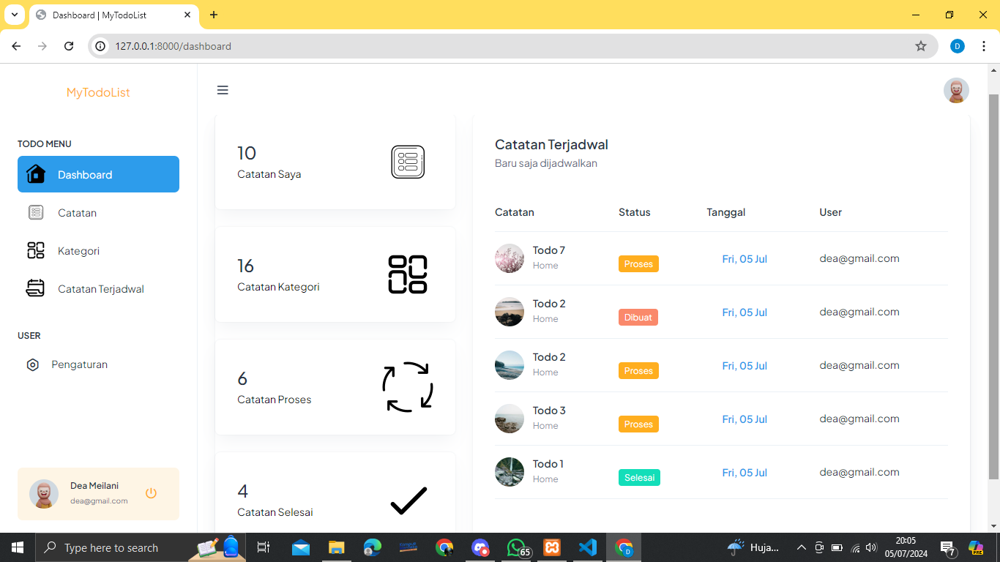
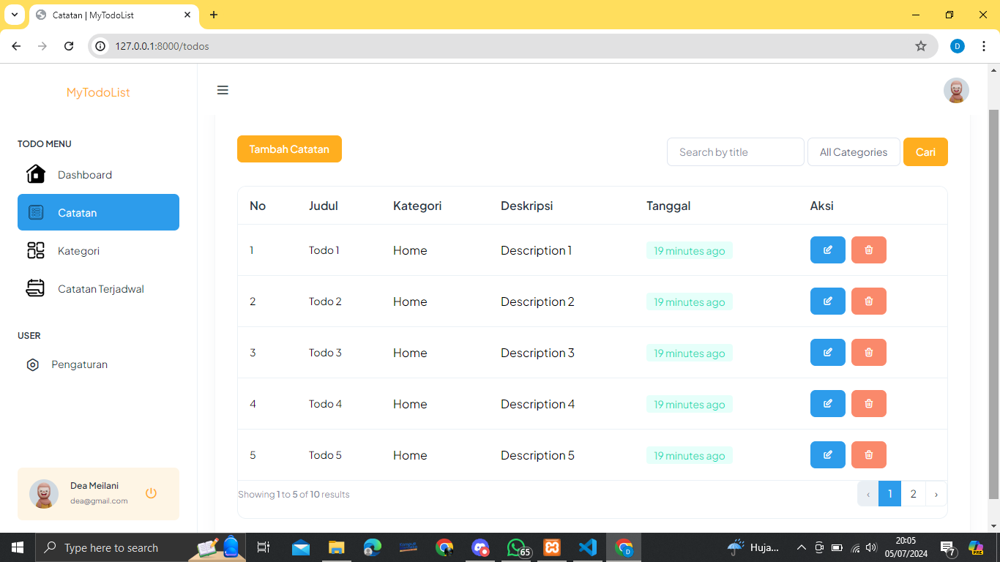

## Tugas tambahan melengkapi Todo Apps
### Nama    : Dea Meilani 
### NPM     : 21552011273
### Kelas   : TIF 221PC 

# Todo List Web Application

## Deskripsi
Aplikasi web Todo List ini dirancang untuk membantu pengguna mengelola dan memantau daftar tugas mereka dengan cara yang lebih intuitif dan menyenangkan. Aplikasi ini dilengkapi dengan fitur login, register, edit profil, dan fitur unggulan seperti dashboard, manajemen & monitoring daftar tugas, penambahan kategori, dan penjadwalan tugas.

## Fitur Utama
- **Login**: Pengguna dapat masuk ke akun mereka menggunakan kredensial yang telah didaftarkan.
- **Register**: Pengguna baru dapat membuat akun baru untuk mulai menggunakan aplikasi.
- **Edit Profil**: Pengguna dapat memperbarui informasi profil mereka.

## Fitur Unggulan
- **Dashboard**: Manajemen & monitoring aplikasi todo list yang mudah digunakan.
- **Intuitif Todo**: Memungkinkan pengguna untuk mencatat pekerjaan dengan lebih mudah dan menyenangkan.
- **Category**: Pengguna dapat menambahkan kategori sesuai dengan keperluan mereka.
- **Todo Schedule**: Jadwalkan tugas agar teratur dan terorganisir dengan baik.

## Teknologi yang Digunakan
- PHP Laravel
- Database: MySQL
- Bootstrap

## UI
### Beranda 

    

### Halaman Login

    

### Dashboard

    

### Halaman Catatan

    

### Halaman Kategori

    

### Pengaturan Profile

    

---
© 2024 Dea Meilani

